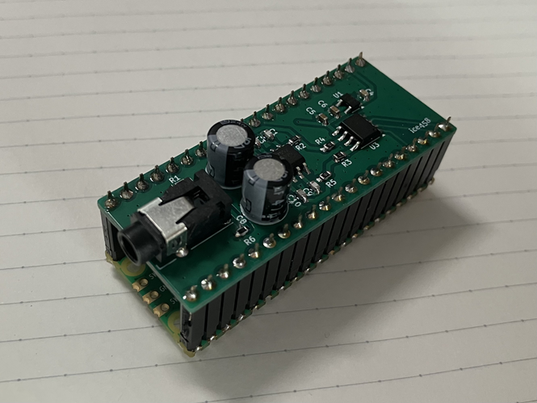

# Pico Synthesizer

A synthesizer project for the Raspberry Pi Pico 2.  

## Description

This project aims to create a functional 16-channel polyphonic synthesizer with a maximum of 20 voices running on the Raspberry Pi Pico 2 microcontroller. It includes various features like multiple waveform generation, envelope control, MIDI input processing, and more.

## Features

*   Polyphonic sound generation
*   Multiple waveforms (Sine, Sawtooth, Triangle, Square, Noise)
*   ADSR envelope
*   MIDI input processing (Note On/Off, Pitch Bend, CC messages)
*   PCM drum sample playback
*   Reverb effect (Master output)
*   Master volume and DC cut filter

## Tools

The `tools` directory contains Python scripts used to generate various data tables and C header files required by the synthesizer:

*   `wave_table.py`: Generates waveform tables and MIDI note-to-frequency increment tables.
*   `pitch_bend_table_interpolated.py`: Generates tables for pitch bend calculations.
*   `drum_table.py`: Processes a WAV file containing drum samples and converts them into C arrays for PCM playback.
*   `pan_table.py`: Generates tables for pan calculations.

## License

This project is licensed under the MIT License. See the `LICENSE` file for more details.

Additionally, the drum samples provided in `tools/drum/drum.wav` were generated using the `MuseScore_General.sf2` soundfont. The license for `MuseScore_General.sf2` can be found in `tools/drum/MuseScore_General_License.md`.
